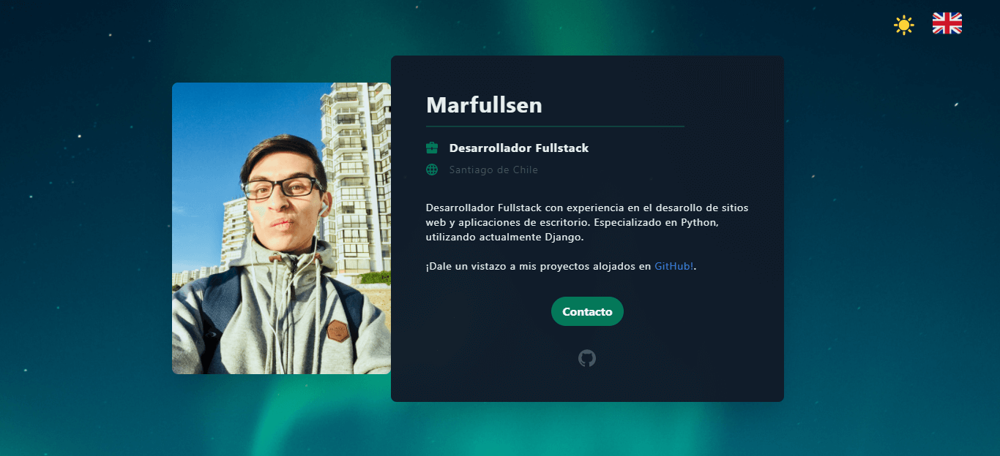
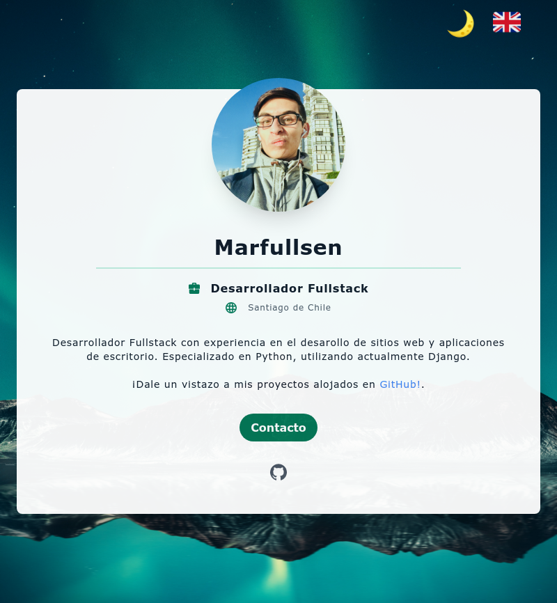

# [Marfullsen.GitHub.io](https://marfullsen.github.io/)

## Marfullsen landing page.
Página de contato de Marfullsen.

- Sitio disponible en español e inglés.
- Modo nocturno.

## Screenshots
**Tablet**

**Mobile**

## Créditos
Gracias a [Tailwind CSS](https://www.tailwindcss.com/), un gran framework para trabajar día a día. ¡La plantilla original está disponible en [tailwindtoolbox.com](https://www.tailwindtoolbox.com/starter-templates) entre las plantillas gratuitas para comenzar a usar el framework!

También agradezco a [screenshots.cloud](https://screenshots.cloud/), por las geniales capturas de pantalla completa del sitio en versión móvil.